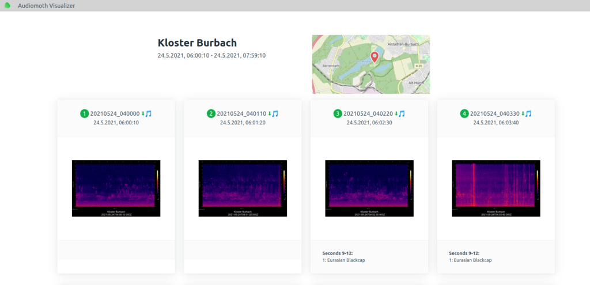
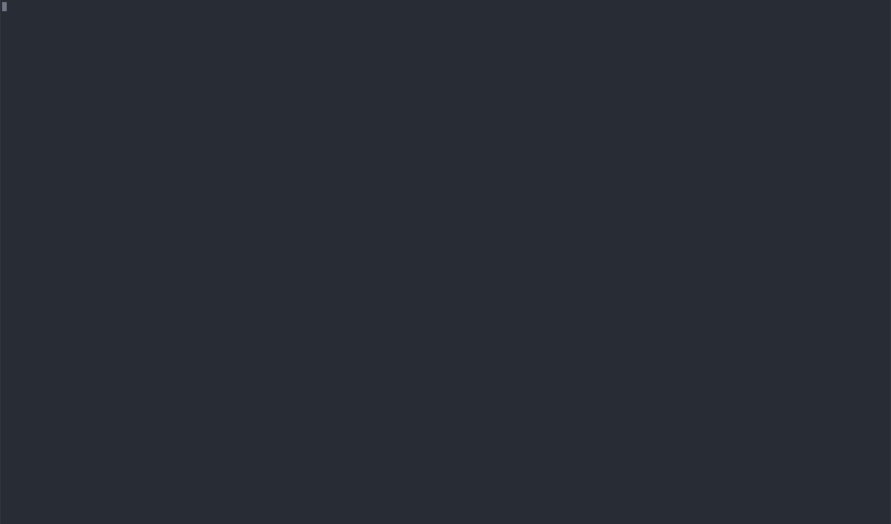

# Audiomoth Visualizer

Node.js pipeline in the console for spectrograms creation and [Birdnet](https://github.com/kahst/BirdNET) detection for your [Audiomoth](https://www.openacousticdevices.info/audiomoth) sessions.  
It will create a movie per audiofile with a spectrogram as image and utilizes birdnet AI to detect bird species.  
The HTML page lists all movies and renders the birdnet detections.

## Installation

You will need `docker`,`sox` and `ffmpeg` on your machine.  
On Linux install it like this:

    sudo apt install sox ffmpeg

For docker installation see here: https://docs.docker.com/engine/install/.  
Birdnet detection software will run inside a docker container.

## Usage

#### Globally via npm

Install:

    npm install --global audiomoth-visualizer

Run:

    audiomoth-visualizer <path-to/my-audiomoth-session> <destination-dir> --title="Session title" --locale=de-DE --timezone=Europe/Berlin --lat=50.8754444 --lng=6.8380488

#### Running on-demand:

Run:

    npx audiomoth-visualizer <path-to/my-audiomoth-session> <destination-dir> --title="Session title" --locale=de-DE --timezone=Europe/Berlin --lat=50.8754444 --lng=6.8380488

Using npx you can run the script without installing it first.

#### Local dev environment

Clone this repository:

    git clone git@github.com:ivoba/audiomoth-visualizer.git

Install dependencies:

    npm i

    node index.mjs <path-to/my-audiomoth-session> <destination-dir> --title="Session title" --locale=de-DE --timezone=Europe/Berlin --lat=50.8754444 --lng=6.8380488

Then open the generated `files/my-audiomoth-session/index.html` in your favorite Browser by doubleclick or via console:

    chromium <path-to/my-audiomoth-session>/index.html

## Development

There are entrypoints to test birdnet AI or HTML generation separately:

HTML generation:

    node_modules/.bin/zx html.mjs <path-to/my-audiomoth-session>

Birdnet detection:

    node_modules/.bin/zx birdnet.mjs <path-to/my-audiomoth-session>

## Credits

Heavily inspired by:  
https://github.com/nwolek/audiomoth-scripts

## Todo

- responsive images
- responsive video
- docker image in npx? will the image be pulled?
- docker user permissions on birdnet files
  ` --user $(id -u):$(id -g)`
  user should be used in docker image
- tests
